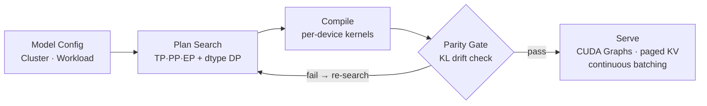

# Skein

A compiler for distributed LLM inference. Skein decides **what** to run across your cluster — TP/PP/EP placement, KV layout, per-layer quantization, CUDA Graphs, prefix cache, continuous batching — and compiles it down to optimized per-device kernels.

## Pipeline



## Crates

| Crate | Role |
|---|---|
| `skein_ir` | typed IR — `Plan`, `ClusterSpec`, `Workload`, HF importer |
| `skein_cost` | 5-term cost model (compute + comm + memory + bubble + launch) |
| `skein_extract` | enumeration over TP/PP/EP axes + DP over per-layer dtype |
| `skein_emit` | `Plan` → per-device graph + sharded weights + topology |
| `skein_compile` | kernel search + artifact format |
| `skein_parity` | KL/MSE parity gate (bf16 reference vs candidate) |
| `skein_runtime` | paged KV, continuous batcher, CUDA Graphs, hot-swap, server |
| `skein_cli` | `extract` · `compile` · `verify` · `serve` · `bench` · `calibrate` |
| `skein_calibrate` | offline calibration of cost constants + drift table |

## Build

```
make build    # CUDA by default; CPU fallback when nvcc is absent
make test
make lint
```

## Run

```
cargo build --release

# Plan search — no GPU needed
./target/release/skein extract \
    --model   configs/mixtral_8x7b_config.json \
    --cluster cluster/rtx6000_2x.toml \
    --trace   cluster/sample_trace.jsonl \
    --drift   models/mixtral_8x7b_drift.toml \
    --cost    cluster/cost_constants.toml \
    --out     artifacts/plan.json

# Full pipeline
./target/release/skein compile  --model ... --cluster cluster/rtx6000_2x.toml --weights ... --out artifacts/
./target/release/skein verify   --artifact artifacts/LATEST
./target/release/skein serve    --artifact artifacts/LATEST --port 8080
./target/release/skein bench    --artifact artifacts/LATEST --baseline <vllm-endpoint>

# Calibrate once per (hardware, model) pair
./target/release/skein calibrate \
    --hardware rtx_pro_6000_blackwell \
    --model    configs/mixtral_8x7b_config.json \
    --corpus   crates/skein_calibrate/corpus/mixtral_8x7b.toml
```

See `docs/` for the detailed design of each stage.
